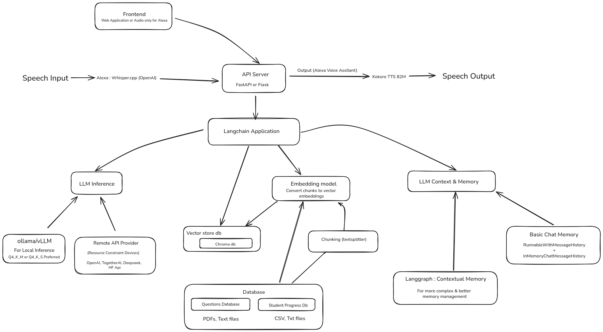

<p align="center">
  <strong style="font-size:40px">studyLM</strong>
</p>

<p align="center">
  
</p>

---

## Get Started

Install dependencies using [UV](https://github.com/astral-sh/uv), a fast Python package manager:

```bash
uv sync
uv run main.py
